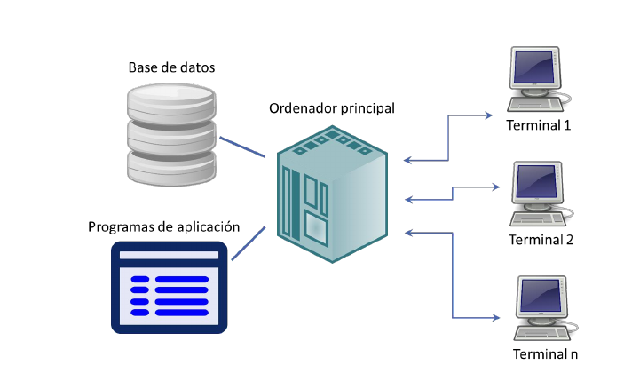
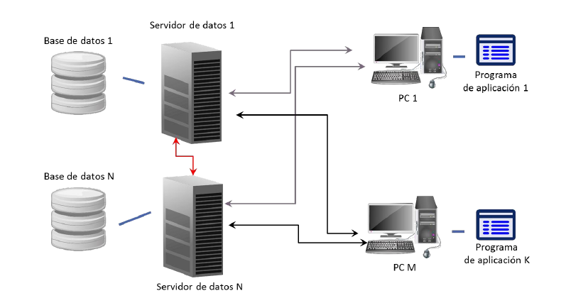
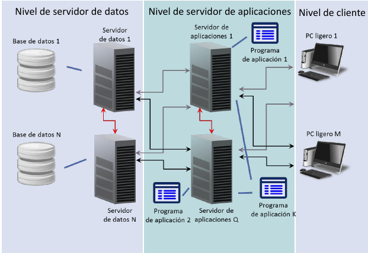

# Niveles Generales de una BD
 Dividimos las bases de datos en tres niveles:
- Interno: muestra la representación física del almacenamiento de la BD en el ordenador. Busca rendimiento óptimo. Se ven representadas las Estructuras de Datos, organizaciones en ficheros, comunicación con el SO y compresión de datos. En este parte de las tareas las realiza el SO (dependiendo de la BD será mas o menos).
- Conceptual: muestra una visión global de los datos junto con su estructura lógica, esto último es los datos que están almacenados y las relaciones que existen entre ellos. Muestra entidades, atributos, relaciones, restricciones e información de seguridad e integridad. Da soporte a cada vista externa y no debe contener ningún detalle de almacenamiento.
- Externo : muestra a cada usuario la información que le es relevante. Depende del usuario los datos se representarán de una forma u otra. Se muestran datos calculados a partir de los disponibles(edad, ventas totales).

Esto lo hacemos básicamente para aumentar la independencia de nuestra BD.

#### Correspondencia entre niveles (No resumido)

## Lenguajes de una BD
 Se necesita un lenguaje específico orientado a objetos (DSL) que permita definir esquemas, controlar la BD, y manipular los datos. Cada SGBD tiene su DSL, nosotros trabajaremos con SQL.

 Un DSL tiene distintas partes:
  - Data Definition Language (DDL) : permite definir estructuras de datos y esquemas de la BD
  - Data Manipulation Lenguaje (DML) : permite operar con los datos (CRUD)
  - Data Control Language (DCL) : permite gestionar los requisitos de acceso y otras tareas de administración .

Se recomienda disponer de un DDL, un DML y un DCL para cada nivel de la arquitectura, sin embargo en la práctica se tiene una implementación única, donde una sentencia trabaja a varios niveles y un sistema de privilegios dice quién puede ejecutar qué.

 **Lenguaje anfitrión** : lenguajes de propósito general que se usan para trabajar sobre la BD. (C/C++/Java...)

 En los lenguajes **débilmente acoplados** se pueden distinguir las sentencias del DSL de las del lenguaje anfitrión. Para implementar estos lenguajes se necesita una API de acceso a la BD y el lenguaje en sí, que es un código híbrido entre lenguaje anfitrión y el DSL que luego es transformado por un preprocesador.

  En los fuertemente acoplados se usn lenguajes y herramientas de propósito específico, añadiendo características al DSL (aquí no se distinguen unas sentencias de otras). Para este tipo de lenguajes se necesita ejecutar Java sobre una máquina virtual implementada en el SGBD y un lenguaje como SQL.

## Administrador de la BD
- Elabora el esquema conceptual
- Decide la estrictira de almacenamiento en el nivel interno
- Diseña la conexión con los usuarios
- Define restricciones de integridad.
- Define e implanta la política de seguridad.
- Define e implanta la estrategia de recuperación frente a fallos.
- Optimización del rendimiento.
- Monitorización del SGBD

## Tipos de arquitecturas e implementación

### Esquema centralizado
Primer esquema en la historia de las BD.

- Toda la gestión y procesamiento recae sobre los servidores centrales.
- El usuario accede mediante terminales

- **Problema:** Elevado coste de los ordenadores principales
- **Solución:** aproximación al esquema cliente/servidor y desplazar la ejecución de los programas de usuario y la interacción hacia los PCs.

### Esquema distribuido y C/S

- **Problema:** alto coste de los mantenimientos del PC (configuración, actualización...)
- **Solución:** separar la ejecución lógica del programa de la interfaz a la que accede el usuario.

### Esquema tres niveles
- Nivel Servidor de datos: las peticiones desde una sede se traducen de forma transparente a otras sedes. Posiblemente organización distribuida. Permite organizar la información como una BD global.

- Nivel Servidor de aplicaciones: evoluciones de Servidores Web que proporcionan los programas de aplicación.

- Nivel cliente: nivel del usuario

- **Ventajas:** reducción de costo en cuanto al mantenimiento de clientes, ya que se mantiene el servidor y no los pc's individuales. Mayor facilidad y flexibilidad para el usuario.

- **Inconvenientes:** mayor dificultad a la hora de configurar servidores de aplicaciones y a la hora de desarrollar aplicaciones.
