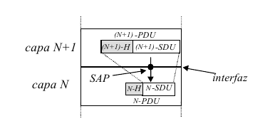

# Sistemas de Comunicación y Redes

 Sistemas de Comunicación : es la infraestructura (hardware y software) que permite intercambio de información.

 Red : es un sistema de comunicación que cuenta con hosts y facilita el intercaambio eficaz y transparente de información. Que cuente con hosts significa que alguien tiene que "organizar" la red.

### Razones para usar redes:
 - Compartir recursos
 - Escalabilidad
 - Fiabilidad, robustez (al tener datos repetidos en diferentes hosts la caída de uno de ellos no afecta tanto)
 - Ahorro de costes

### Clasificación:
 · Por escala
  - LAN
  - MAN
  - WAN

 · Por canal de comunicación
  - Difusión/Canal compartido (Inalámbrica como WiFi, BlueTooth...)
  - Punto a Punto (Cableado como ADSL, fibra...)

### Estructura y elementos de una red
 · Hosts: sistemas finales autónomos que pueden procesar datos
 · Subred: infraestructura para el transporte de información, cuenta con líneas de transmisión (por donde pasa la información) y con nodos de conmutación (routers, que "repiten" los mensajes)

# Diseño y estandarización de redes
 En los estándares de red se realiza un diseño por capas, donde diferentes capas tienen diferentes funcionalidades y se busca minimizar el flujo de información de una capa a otra.

# Terminología y conceptos

 · Entidad: capa de abstracción.
 · Entidades pares: capas del mismo nivel que se comunican (virtualmente)
 · Protocolo: conjunto de reglas que regulan el intercambio de información virtual entre entidades pares. (Indica cómo tiene que enviar la información una capa y lo que recibe su entidad par). Ej: http
 · Servicio: funcionalidad de una entidad.
 · Arquitectura de red : Modelo de referencia + pila de protocolos
 · Intercambio transparente: aquel intercambio de información que se realiza sin problemas y es independiente del SO.
 · Interfaz: capa de abstracción para la comunicación (real) entre entidades de dos niveles contiguos (n y n+1)
 · Comunicación virtual: "Comunicación" entre dos capas del mismo nivel.
 · Comunicación real: Comunicación entre la capa n y la n+1.

## Comunicación entre capas contiguas
 
 La capa N y la N+1 mantienen una comunicación real que se realiza a través de una interfaz. Al enviar información, vamos bajando de capa, y cada capa añade una cabecera. Cuando se recibe información, vamos subiendo de capa, y cada una quita la cabecera que puso su entidad par en el envío.

## Ejemplo comunicaciones real/virtual
Imaginemos una conversación entre un inglés y un japonés, con sus respectivos traductores, y estos últimos comunicandose a través de un pinganillo. Habría comunicación virtual entre el inglés y el japonés y entre los dos traductores. Habría comunicación real únicamente entre los hablantes y sendos traductores, y entre los traductores y sus respectivos pinganillos. Entre los pinganillos habría comunicación de canal compartido (?, no detallamos).

# Servicios

 - Orientado a conexión (SOC): antes de enviar la información, se necesita confirmar que se puede establecer conexión. Se manda una señal previa que necesita ser confirmada, y se manda una señal al finalizar. Ej: llamada, donde necesitamos que nos cojan el teléfono.
 - No orientado a conexión (SNOC): No ocurre lo anterior. Ej: TV.

 - Confirmado (fiable): Cuando mandamos información, recibimos una confirmación de que ha llegado.
 - No confirmado (no fiable): no ocurre lo anterior.

 ## Me dejo sin poner
 Tiempos de retardo y topologia (tiers y eso).
