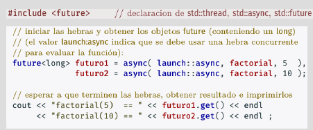

# Hebras

Compilación: `g++ -std=c++11 -o NOMBREPROG -lpthread FUENTES.CPP`

Creación: `thread hebra1(funcion_h1, param1, param2...)`

Cada vez que se crea una hebra recibe un identificador único. Dos hebras que invoquen a la misma función (deben recibir parámetros distintos) tendrán distinto identificador.

## Obtención de resultados
Tres opciones:

 - Variables globales
- Punteros en función
- Objetos `future`, usando `async` para iniciar la hebra.

## Terminación hebras

Una hebra termina cuando:

 - Su función asociada termina
- Su función asociada hace return
- Hay una excepción que no se captura en f ni en funciones llamadas desde f
- Se destruye la variable tipo `thread` asociada

La **hebra principal** termina de ejecutarse cuando termina el `main`. Es necesario que se espere a las demás hebras antes de finalizar.

**Todas las hebras** terminan cuando se termina el proceso. P. ej si desde una hebra no principal se llama a `exit()` o `abort`.

Para que la hebra principal espere a **hebra1** hay que ejecutar en el main: `hebra1.join()` (Operación de unión)

# Medición de tiempos
Dos tipos de datos:

 - `time_point`: captura el tiempo
- `duration`: diferencia entre dos instantes de tiempo.  

Tres relojes distintos:

 - `system_clock`: tiempo del sistema
- `steady_clock`: tiempo real. Es el que vamos a usar
- `high_precision_clock`: reloj de max. precision

Ejemplo de uso:
`time_point<steady_clock> inicio=steady_clock::now();
 duration<float,micro> dur=final-inicio;`

# Sincronización
Usar objetos mutex requiere mucho más tiempo que las intrucciones atómicas.

## Tipo atómico

En C++ hay un tipo atómico atomic<T> que asegura que las operaciones `=, ++, --, +=, -=` se hacen de forma atómica (implementadas en el procesador).

## Objetos Mutex
Son cerrojos implementados en estructuras de datos. Tiene dos operaciones: `lock()` y `unlock()`.

# Semáforos
Contiene los siguientes datos en memoria compartida:

 - Conjunto de procesos esperando al semáforo
- Valor del semáforo (entero no negativo)

Dos operaciones:

 - `sem_wait(s)`: Decrementa el valor del semáforo en 1. Si el valor del semáforo es 0, entonces espera a que sea positivo.
- `sem_signal(s)` : Aumenta el valor del semáforo en 1.

Suponiendo que inicio el semáforo a 0, un proceso que use `sem_wait()` se esperará hasta que otro haga `sem_signal()` sobre el mismo semáforo.

Todas las operaciones sobre semáforos se hacen en exclusión mutua (menos la espera por que no hace falta). Los semáforos (los que usaremos) se inicializan obligatoriamente en la declaración. Este tipo de datos se puede pasar como parámetro pero no puede ser copiado mediante `=`. Se destruyen automáticamente y se suelen declarar como variables globales compartidas.
