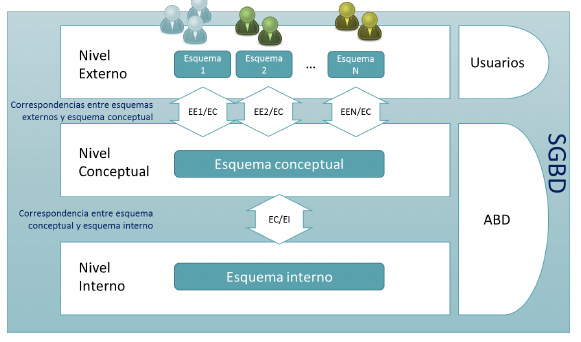

# Niveles Generales de una BD
 Dividimos las bases de datos en tres niveles:
- Interno
- Conceptual
- Externo

Esto lo hacemos básicamente para aumentar la independencia de nuestra BD.

#### Correspondencia entre niveles (No resumido)

## Lenguajes de una BD
 Se necesita un lenguaje específico orientado a objetos (DSL) que permita definir esquemas, controlar la BD, y manipular los datos. Cada SGBD tiene su DSL, nosotros trabajaremos con SQL.

 Un DSL tiene distintas partes:
  - Data Definition Language (DDL) : permite definir estructuras de datos y esquemas de la BD
  - Data Manipulation Lenguaje (DML) : permite operar con los datos (CRUD)
  - Data Control Language (DCL) : permite gestionar los requisitos de acceso y otras tareas de administracion .

Se recomienda disponer de un DDL, un DML y un DCL para cada nivel de la arquitectura, sin embargo en la práctica se tiene una implementación única, donde una sentencia trabaja a varios niveles y un sistema de privilegios dice quién puede ejecutar qué.

 Lenguaje anfitrión : lenguajes de propósito general que se usan para trabajar sobre la BD.

 En los lenguajes débilmente acoplados se pueden distinguir las sentencias del DSL de las del lenguaje anfitrión.
