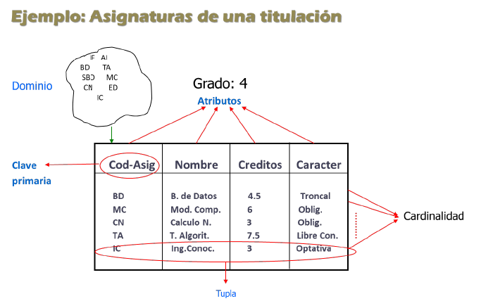
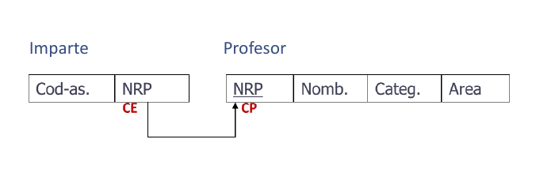

# Definición del modelo de datos
 El modelo de datos es el mecanismo formal para representar y manipular la información de manera general y sistemática. Consta de diferentes notaciones para escribir datos, operaciones y reglas de integridad. Debe ser descrito de una forma entendible y manipulable.

 Cada esquema se describe usando un lenguaje de definición de datos de bajo nivel, que está muy ligado al SGBD. Hacen falta otros mecanismos de más alto nivel para describir sin ambigüedades y de forma entendible el proceso de implantación.

# Modelo de datos relacional

## Estructuras de datos

El modelo relacional abarca tres ámbitos distintos de los datos:

- El usuario percibe la información estructurada en tablas (estructuras)
- Las tablas deben cumplir ciertas condiciones para mantener la **integridad y coherencia** de la información que contienen.
- Los operadores empleados se aplican sobre tablas y devuelven tablas. (consulta y manipulación)

### Definiciones
- **Atributo:** cualquier elemento que pueda tomar valores. Ej: nombre.
- **Dominio:** rango de valores que toma un atributo, se considera finito.
- **Relación:** una aplicación desde un conjunto de atributos hacia un subconjunto del producto cartesiano de sus dominios (prod cart de cada dominio de cada atributo).
- **T-upla:** cada una de las filas de una relación
- **Cardinalidad de una relación:** número de tuplas. Puede cambiar con el tiempo
- **Esquema de una relación:** sus atributos juntos con sus respectivos dominios.
- **Grado de una relación:** número de atributos de su esquema. Invariable en el tiempo.
- **Instancia de una relación:** Conjuntos de tuplas, contenidas en el producto cartesiano de los dominios, que componen la relación en cada momento.

### Propiedades
- Todos los valores de los atributos son atómicos, es decir, no estructurados. Si cumple esta condición se dice que una relación está en primera forma normal.
- No hay valores tipo conjunto, registro, o tablas.
- Las representaciones son extensivas: hay que ir nombrando uno a uno, no existe un valor con el/un conjunto de atributos.
- No hay tuplas duplicadas
- No hay orden en las filas ni los atributos.
- Varias instancias representan la misma relación.

## Restricciones de integridad
Son las normas que mantienen la correción semántica de la base de datos.

Hay restricciones específicas del problema, como una edad máxima o mínima y determinadas asignaturas (el hecho de que sean unas y no otras). También hay restricciones en cuanto a las relaciones, como que un profesor inexistente no puede impartir una asignatura, o que una asignatura deba tener un código distinto al nulo.

### Claves

- **Clave externa:** conjunto de atributos en una relación que es clave en otra.
- **Superclave**: cualquier conjunto de atributos que identifica unívocamente a cada tupla.
- **Clave (candidata)**: elemento o conjunto de elementos que identifica a la tupla (que es superclave) y verifica que no hay subconjunto suyo que identifique de manera única a la tupla. Ej: {Cod_Asig, nombre_asig} no es una clave candidata pero Cod_Asig sí.

De entre las claves candidatas hay que elegir una como principal que se denomina clave Primaria. La elige el programador en función del tamaño,significado ...

### Integridad de entidad

No se puede representar una entidad en la base de datos si la clave primaria o una parte de ella es un valor nulo.

### Integridad referencial

Si hay una clave externa conectada a una clave primaria, el valor de la clave externa debe ser o un valor del dominio activo de la clave primaria o completamente nulo.

- **Inserción:** se rechaza si el valor introducido como CP ya está presente en la BD(o es nulo); si el valor de su CE no concuerda en relación a la CP; o si el valor de la CE es nulo y el diseño no lo permite.
- **Actualización:** se rechaza si ocurre algúnn caso del punto anterior. Si se actualiza la CP hay que actualizar todas las CE que la referencien.
- **Borrado:** si se borra la CP en la relación, borrar todas las tuplas que la referencien o poner valor nulo en la CE de esas tuplas.
