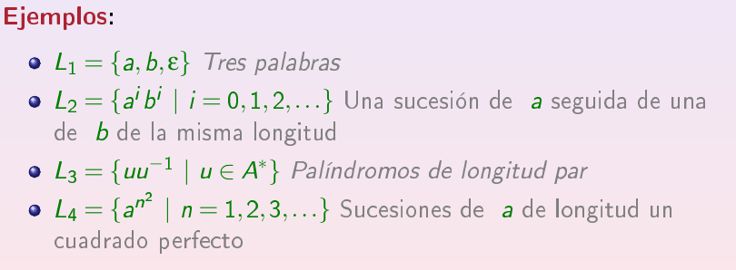

# Definiciones
 - __Alfabeto__ : conjunto finito. A sus elementos los llamamos símbolos o letras. Los símbolos los escribimos en minúscula y los alfabetos en mayúscula.

- __Palabra__ (de un alfabeto A) : sucesión finita de elementos de A. \$ u=a_{1}···a_{n}, a_{i} \in A  \$

- __A*__ : conjunto de todas las palabras de un alfabeto A.

- __Longitud de palabra__: La longitud de una palabra *u* se define como el número de símbolos (del alfabeto) que contiene. Se indica como |*u*\|

- __Palabra vacía__: es la palabra de longitud cero y se denota por ε

- __A^+__ : Conjunto de todas las palabras de un alfabeto excluyendo la palabra vacía.

- __Prefijo__: Una palabra u es prefijo de otra z si existe una palabra v tal que u.v=z

- __Sufijo__: Una palabra u es sufijo de otra z si existe una palabra v tal que v.u=z

- __Lenguaje__ (Sobre un alfabeto): es un subconjunto del conjunto de todas las palabras sobre ese alfabeto.

- __Lenguaje inverso__ : el lenguaje inverso de L es quel cuyas palabras son las palabras de L inversas.

- __Cabecera__ : la cabecera de un lenguaje L es otro lenguaje, definido por, aquellas palabras a las que se le pueden concatenar palabras de A* tal que el resultado sea una palabra de L. Algo así como un conjunto de prefijos universal.

- __Homomorfismo__ : es una aplicación entre dos alfabetos tal que h(uv)=h(u)h(v)

#### Concatenación
Es básicamente unir dos palabras que pertenezcan a __A*__. Se expresa por u.v ó uv, y sería igual a la palabra u seguida de la palabra v. Tiene las siguientes propiedades:
1. |u.v|=|u|+|v| (La longitud de la concatenación es igual a la suma de las longitudes)
2. Asociativa: u.(v.w)=(u.v).w
3. Elemento neutro: u.ε=ε.u=u

Un conjunto de palabras con un alfabeto A y la operacion de concatenación tiene estructura de monoide.

La **iteración n-ésima** de una cadena (u^n) es la concatenación con ella misma n veces.

- u^0=ε
- u^(i+1)=u^i.u

La __concatenación de lenguajes__ da como resultado otro lenguaje que se forma por: una palabra del primer lenguaje concatenada con una del segundo lenguaje.

1. L.0=0.L=0  0=conjunto vacío
2. Elemento neutro: {ε}L=L{ε}=L
3. Asociativa: L1(L2L3)=(L1L2)L3

La __iteración de lenguajes__ se define de forma recursiva:

- L^0={ε}
- L^(i+1)=L^iL

## Gramáticas
Una gramática generativa es una cuádrupla (V,T,P,S) donde:

- _V_ es un alfabeto, llamado __variables__ o __símbolos No Terminales__
- _T_ es un alfabeto, llamado __símbolos terminales__
- _P_ es un conjunto finito de pares (a,b), llamados __reglas de producción__. a,b pertenecen a cualquier cadena posible de la unión de _V_ y _T_, y _a_ contiene al menos un símbolo de V.
- _S_ es un elemento de _V_, llamado __símbolo de partida__

Dada una gramática y dos palabras a y b, tenemos que b es __derivable en un paso__ a partir de a si y solo si existe una producción c->d tal que:
-  _a_ contiene a _c_ como subcadena.
- _b_ se obtiene sustituyendo _c_ por _d_ en _a_.

Dada una gramática y dos palabras a y b, tenemos que _b_ es __derivable__ a partir de a si y solo si existe una sucesión de palabras que sean derivables en un paso y se pueda llegar de _a_ hasta _b_

El __lenguaje generado__ por una gramática es el conjunto de cadenas formadas por símbolos terminales y que son derivables a partir del símbolo de partida.

## Jerarquía de Chomsky
- __Tipo 0:__ cualquier gramática, sin restricciones.
- __Tipo 1:__ puedo tener más de una variable (por lo menos una) y más de una palabra a la izquierda , y lo que sea a la derecha.
- __Tipo 2:__ solo puedo tener una variable a la izquierda, a la derecha lo que sea
- __Tipo 3:__ solo puedo tener una variable a la izquierda, y a la derecha una palabra o una palabra con una variable a la derecha.

#### Aparte
- El conjunto de lenguajes sobre A* nunca es numerable.
- Clausura de Kleen pág 30-31
- Ver ejercicios al final de las diapositivas
